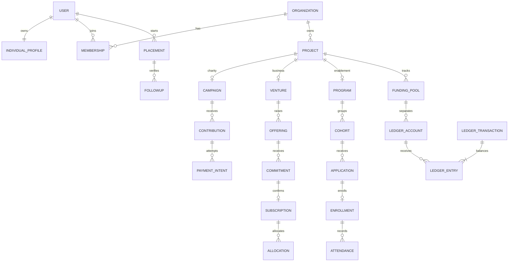

# 09 — نموذج البيانات

## قواعد عامة

معرفات UUID؛ timestamps بتوقيت UTC؛ `created_by` و`updated_by` للكائنات القابلة للتعديل؛ `version` للتزامن المتفائل؛ `org_id` على البيانات المؤسسية. FK وunique وcheck حسب القيود. لا soft delete للقيود المالية؛ إخفاء/أرشفة كائن أعمال لا يمحو التاريخ.

| المجموعة | الجداول وحقول جوهرية | القيود |
|---|---|---|
| الهوية | users(email_normalized,status), sessions(token_hash,expires_at), individual_profiles(user_id,display_name,locale), capabilities(user_id,code) | بريد فريد، ملف واحد لكل user، capability فريدة |
| الجهات | organizations(type,status,public_slug), memberships(org_id,user_id,status), membership_roles, invitations(token_hash,email,expires_at), org_capabilities | عضوية واحدة لكل فرد وجهة، owner نشط واحد على الأقل |
| الأذونات | roles, permissions, role_permissions, scoped_grants(resource_type,resource_id,expires_at) | default deny، grants مؤقتة عند اللزوم |
| التوثيق | verification_cases(subject_type,id,state,reviewer_id), verification_documents, review_decisions | سجل نسخ؛ فصل مقدم الطلب عن المراجع |
| المشاريع | projects(org_id,type,slug,state,manager_id,city_id,public_location_precision), project_versions, project_partners, project_milestones, project_updates | type ثابت بعد النشر؛ manager عضو نشط |
| الملفات | documents(owner_org_id,classification,storage_key,checksum,scan_state), document_versions, document_grants | لا URL عام لوثائق خاصة |
| خيري | campaigns(project_id,goal_minor,currency,policy,end_at), budgets, budget_lines, budget_versions, contributions(payer_party_id,visibility,show_amount,state) | campaign واحد للمشروع الخيري في البداية، goal > 0 |
| المال | funding_pools(project_id,kind,currency), payment_intents, payment_attempts, settlements, refunds, payout_requests, payout_approvals, bank_recipients | unique provider refs؛ مبلغ موجب وعملة مطابقة |
| الدفتر | ledger_accounts(pool_id,currency,type), ledger_transactions(source_type,source_id,reversal_of), ledger_entries(tx_id,account_id,debit_minor,credit_minor) | طرف واحد موجب لكل entry؛ توازن transaction يتحقق بخدمة/constraint trigger عند commit |
| التشغيل المالي | webhook_inbox, outbox_events, idempotency_records(actor,route,key,request_hash), reconciliation_batches, reconciliation_items, disputes | unique(provider,event_id)، idempotency مع hash |
| الاستثمار | ventures(project_id,issuer_org_id), offerings(venture_id,instrument,price_minor,min_raise,max_raise,units_offered,state,version), disclosures, investor_eligibility | version الإفصاح محفوظ؛ eligibility منفصلة لكل party/عرض عند الحاجة |
| ملكية | commitments(party_id,offering_id,amount,expires_at), subscriptions(disclosure_version,agreement_id), allocations(units,proof_id), holdings(party_id,offering_id,units), distributions, distribution_items | تخصيص لا يتجاوز المسوى أو الوحدات؛ holding من allocation مثبت |
| غرفة بيانات | dataroom_grants, nda_acceptances, investor_questions, company_reports, corporate_events | نطاق offering؛ إقرار نسخة بعينها |
| تمكين | programs(project_id,operator_org_id,state), funding_agreements(sponsor_org_id,pool_id,version), cohorts(capacity,start_at), sessions_training, mentor_assignments | المشروع enablement؛ مصدر المال مفصول |
| متقدمون | candidate_profiles(user_id), skills, candidate_skills, applications(target_type,target_id,user_id,state), application_reviews, interviews, enrollments, waitlist_entries | طلب واحد لكل user/target؛ قبول مقاعد بقفل |
| تدريب | attendance(enrollment_id,session_id,status), attendance_revisions, assessments, assessment_results, stipends, certificates | حضور واحد فعال للجلسة؛ revisions مدققة |
| وظائف | jobs(org_id,program_id?,state), job_offers(application_id,version,state), placements(job_id,user_id,start_date,state), followups(placement_id,day_offset,result) | followup فريد 30/90؛ لا نشر job بلا جهة |
| أفكار | venture_proposals(user_id,state), incubation_agreements, incubation_milestones | الفكرة خاصة حتى موافقة صاحبها |
| دعم وتطوع | assistance_cases(user_id,assigned_org_id,state), consents, aid_deliveries, volunteer_opportunities, volunteer_applications, volunteer_assignments, volunteer_hours | الوصول بتكليف؛ تسليم يحتاج دليل |
| مشترك | follows, bookmarks, notifications, notification_preferences, support_tickets, ticket_messages, audit_events, public_reports | منع duplicates؛ read_at لا يمحو سجل الإرسال |

## Party بدل مالك مبهم

`parties(id, kind=individual|organization, user_id?,org_id?)` بقيد exactly one وunique لكل مرجع. كل payer/investor/sponsor يشير party_id؛ actor_user_id يحتفظ بمن نفذ نيابة عنها. تجنب عمود owner_id بلا نوع يخلط مؤسسة بفرد.

## العلاقات الرئيسية

## الفهارس والقراءة

index(org_id,state,created_at)، index(public_slug) فريد، index(user_id,target_id)، index(provider,external_id) فريد، index(pool_id,posted_at)، index(outbox status,next_attempt_at). البحث العربي يبدأ PostgreSQL مع normalization مدروس والاحتفاظ بالنص الأصلي، ثم محرك خارجي فقط إن أثبت القياس الحاجة. الخرائط تستخدم city + coordinates عامة؛ PostGIS عند الحاجة الفعلية للبحث المكاني.

## البيانات الخاصة والعامة

PublicProjectView وPublicOrganizationView وPublicContributionView DTOs allowlist، لا `SELECT *` ثم حذف حقول. لا تضع مستند هوية أو صحة في جدول قابل للفهرسة العامة. تخزين PII منفصل منطقيًا ومشفر على مستوى التخزين مع صلاحيات مفصلة.

## migrations وretention

Migration versioned مع فحص ترقية قاعدة تحوي بيانات. لا destructive migration تلقائيًا. retention matrix لكل تصنيف تحدد المدة عند قرار التشغيل؛ قبل ذلك لا تخترع مدة قانونية. طلب حذف يمحو/يعزل بيانات قابلة للحذف مع pseudonymization حيث يلزم حفظ السجلات، ويشرح النتيجة للمستخدم. سياسة audit immutable وbackup قابلة للاستعادة والاختبار.
